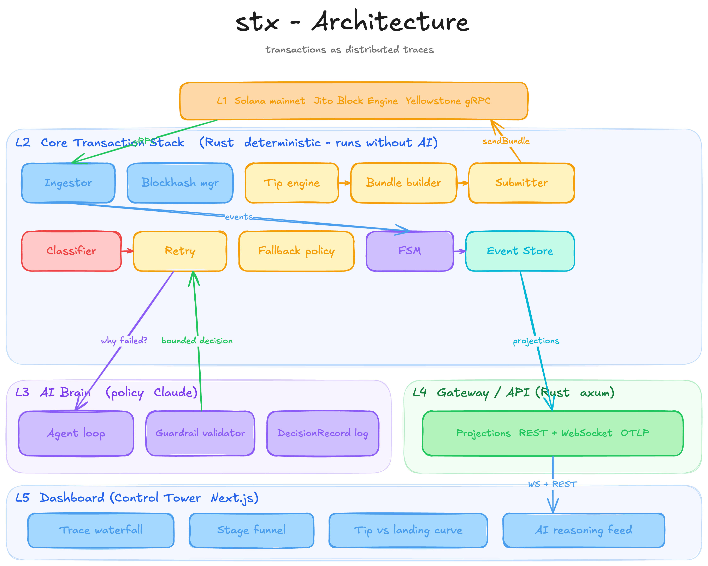

# stx

**A Solana transaction control tower.** Every transaction is a trace: from submitted to finalized, with the tip and the retry decisions that got it there.

[Live dashboard](https://stx-alpha.vercel.app) · [Architecture](docs/ARCHITECTURE.md) · [A landed bundle on Solscan](https://solscan.io/tx/2qkVdddLBRUgG4bBJeA8HCzTpASC46rHjuYxLw59UJvZtuvXagDiR1awzsiFVqZ3YTCWtJfgYGYTErFWaHpQXLsF)



---

## What it does

Sending a transaction on Solana is the easy part. Getting it to land, knowing when it did, and reacting when it does not is the hard part. stx treats that whole journey as one observable object.

It runs on mainnet today. It:

- **Streams the network live** over Yellowstone gRPC (slots, leader windows, and the signatures it cares about).
- **Submits Jito bundles** with tips computed from live tip-floor percentiles (no hardcoded values), fanned out to all 7 Jito regions concurrently for resilience.
- **Confirms landings from validator ground truth** (the Yellowstone stream), cross-checked against RPC. Not polling alone.
- **Classifies failures** from real error and bundle-status data, then **retries automatically**, escalating the tip or refreshing the blockhash as the cause demands, up to a spend ceiling it refuses to overpay past (it aborts instead of landing at any price).
- **Lets an AI agent own one real decision**: on a failure, diagnose the cause and choose the remedy. Its reasoning is recorded and auditable, and a deterministic guardrail bounds every choice.

The deterministic core works fully with the AI switched off. The agent is a quality upgrade at one decision point, never a dependency for the system to run.

---

## See it run

- **Dashboard:** [stx-alpha.vercel.app](https://stx-alpha.vercel.app) shows real mainnet runs as lifecycle timelines, span waterfalls, and the agent's decisions.
- **A real landing:** slot `424863529`, four attempts, tip escalated to land. [View on Solscan](https://solscan.io/tx/2qkVdddLBRUgG4bBJeA8HCzTpASC46rHjuYxLw59UJvZtuvXagDiR1awzsiFVqZ3YTCWtJfgYGYTErFWaHpQXLsF).
- **The raw logs** behind the dashboard live in [docs/evidence](docs/evidence).

---

## Status

Six Rust crates, **66 tests passing** (`cargo test --workspace`), plus a Next.js dashboard. The full submit-and-track loop is verified live on mainnet.

| Crate | Responsibility | Tests |
| --- | --- | --- |
| `stx-core` | Lifecycle FSM, commitment ladder, failure taxonomy, span and funnel projections, event store, deterministic fallback policy | 23 |
| `stx-jito` | Live tip-floor engine, bundle builder, Jito Block Engine client with multi-region fan-out, Solana RPC client, failure classifier | 24 |
| `stx-ingestor` | Yellowstone gRPC: slot and signature streams, observation normalizer, ping keep-alive, auto-reconnect | 5 |
| `stx-agent` | AI tool-use reasoning loop, guardrail validator, auditable decision records, fault injection | 14 |
| `stx-cli` | The `stx` binary: submit orchestrator, agent-steered retry loop, live tip data, stream viewer | live |

---

## Run it

```bash
cargo build --release   # builds the `stx` binary
```

No credentials needed:

```bash
stx tip-floor       # live Jito tip-floor percentiles
stx tip-accounts    # the 8 Jito tip accounts
stx watch-slots     # the Yellowstone slot stream, live
```

The full stack (reads endpoints from `.env.local`, the keypair from `wallet.json`):

```bash
stx submit              # build, submit, and track a real bundle to a landing
stx submit --use-agent  # let the AI agent steer the retries
stx submit --dry-run    # build and simulate only, no submission
```

The AI agent against injected failures (needs `ANTHROPIC_API_KEY`):

```bash
stx fault-inject blockhash-expiry
stx fault-inject fee-starvation
stx fault-inject compute-exhaustion
```

These three are the acceptance test for real reasoning. The agent gathers different evidence and reaches three different remedies (refresh the blockhash, raise the tip, raise the compute limit), not three blanket retries.

---

## The three bounty questions

### 1. What does the delta between `processed_at` and `confirmed_at` tell you about network health?

**It is the latency of the consensus voting round-trip, so it is a direct read on how fast the cluster is reaching agreement.**

A transaction is `processed` the instant the leader includes it. It is `confirmed` only once a supermajority (over two-thirds of stake) has voted through that slot. The gap between the two is the time the cluster took to agree, not the time to execute.

- Small and steady (roughly half a second to a second) means a healthy cluster: votes flowing fast, little fork contention.
- Large or growing means the cluster is struggling. The usual culprits: fork contention (a `processed` transaction can sit on a minority fork until the supermajority votes through it), a high skip rate, or vote and replay lag under congestion.

In the mainnet runs here the gap measured consistently around 0.63 to 0.66 seconds, with confirmed to finalized around 12 seconds (about 32 slots): a healthy cluster. stx records each stage with its real timestamp as the slot climbs the commitment ladder, so the delta is read straight off the trace ([`lifecycle-commitment-ladder.json`](docs/evidence/lifecycle-commitment-ladder.json)).

### 2. Why should you never fetch a blockhash at `finalized` for a time-sensitive transaction?

**A finalized blockhash is already old, so it throws away most of the window the transaction has to land.**

A blockhash is valid for about 150 blocks, roughly 60 to 90 seconds. A finalized blockhash is, by definition, already about 32 slots (around 13 seconds) old. Starting from it burns a fifth of the window before you even sign, which sharply raises the odds of expiry: `BlockhashNotFound` at submit, or `TransactionExpiredBlockheightExceededError` when it never lands.

The trap is that `getLatestBlockhash` defaults to `finalized`. stx fetches at `confirmed` instead: fresh, but on the canonical chain so it will not vanish with a dropped fork. See [`stx-jito/src/solrpc.rs`](crates/stx-jito/src/solrpc.rs).

### 3. What happens to your bundle if the Jito leader skips their slot?

**Nothing lands. The bundle is not rolled over or retried for you; you have to resubmit, targeting the next Jito leader.**

Bundles are only processed by a Jito-Solana leader, and they are atomic: all transactions execute in the same slot, in order, or none do. If that leader skips their slot, there is no block to land in, so the bundle is simply not included. `getInflightBundleStatuses` shows it `Pending`, then it ages out to `Failed` or `Invalid`. It never reaches `Landed`.

You resubmit yourself, against the next Jito leader window, with a fresh blockhash if the old one expired and usually a higher tip, since inclusion is a tip auction. stx's retry loop does exactly this. (A skipped slot is not the same as an uncled block: if a leader builds a block that the supermajority then skips, and someone rebroadcasts the individual transactions, those re-enter the normal banking stage, which does not respect bundle atomicity.)

---

## What I learned running it

These are observations from the real runs, not theory.

- **Confirmation has to win the race against the landing.** My first runs double-submitted: I opened the signature subscription after submitting, so a sub-second landing was missed, and Jito's `getInflightBundleStatuses` reported `Invalid` for bundles that had actually landed. The fix was to subscribe before submitting and cross-check the authoritative RPC `getSignatureStatuses`. A confirmation false-negative is dangerous: it makes the retry loop resubmit a transaction that already landed.
- **Jito's global endpoint mis-reports status.** The same bundle that the global endpoint called `Invalid` had landed on-chain. Using a regional endpoint (Frankfurt, matching the infra) keeps submit and status queries on the same backend.
- **A median tip did not land.** On mainnet at the time, a p50 tip kept getting dropped; it took roughly p95 to land. The fallback now escalates the tip on a non-landing, and the agent, given the history of which tips already failed, escalates the same way and lands.
- **A bare signature filter on the gRPC stream returned nothing.** The provider's geyser silently ignores a `signature`-only transaction filter, so landings were never confirmed from the stream. Filtering by the fee payer's account instead, and matching the exact signature in code, delivers them. I verified this with a [probe](crates/stx-ingestor/examples/watch_tx.rs) (2074 transactions in 6 seconds for a busy account) and a plain self-transfer the probe then caught.
- **Fan-out earns its keep.** On one landing, two of the seven Jito regions rejected the submit that round, and the bundle still landed through the other five. Submitting the same bundle to every region costs nothing extra (one signature can only land once) and removes any single region as a point of failure.

---

## Layout

```text
crates/        the Rust workspace (core, jito, ingestor, agent, cli)
dashboard/     the Next.js control tower (deployed to Vercel)
docs/
  ARCHITECTURE.md      the design document
  diagrams/            the architecture diagram (editable Excalidraw + PNG)
  research/            primary-sourced research dossiers
  evidence/            raw lifecycle logs and agent decisions from real runs
```

## License

MIT
